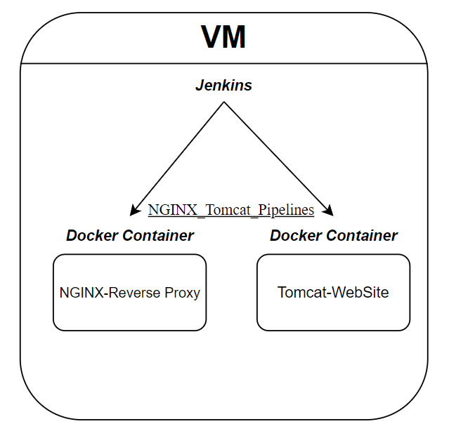

## Vagrant_Linux_Docker_Jenkins_Tomcat_Nginx_Ansible Repo
---
### INFO:
>**In project was used such technologies:** 
>* Vagrant
>* Jenkins
>* Linux(Ubuntu/Centos7)
>* Docker
>* Ansible
>* Tomcat
>* Nginx
>
>
>**List Of Used Jenkins Plugins:**
>* Pipeline
>* Git
>* GitHub
>* Ansible
>* Credentials
>* SSH Agent
>* Publish Over SSH
>* Role-based Authorization Strategy
>* Matrix Authorization Strategy
>* Pipeline: Basic Steps
>* Pipeline: Multibranch
>* Pipeline: Stage Step
>* Pipeline: Input Step
>* Pipeline: Build Step
>
> Infrastructure View:
>
>
>#### **Over roll deploy:** Virtual machine, created and provisioned by Vagrant, than where was installed Jenkins using Ansible. Later after creating, configuring of Jenkins jobs, Tomcat and Nginx was deployed on this VM like containers for further work.
>---
>
---
## **Steps To Deploy::**
1. Firstly clone repo:
    * `git clone git@github.com:teranteks/vagrant_linux_docker_jenkins_tomcat_nginx.git `

2. Next `cd` into vagrant_linux_docker_jenkins_tomcat_nginx folder, go into **ansible/**, edit inventory.ini, if needed. After that go to **ansible/jenkins_setup, ansible/nginx_setup, ansible/tomcat_setup roles**, create vars folder with **main.yaml**, where assign variables for each of directories. 

**List Of Variables for Jenkins Role:** 
* #Docker Network, **network_name: "example"**
   
* #Users: 
**jenkins_master_admin:'admin'**
**jenkins_master_admin_pass: 'pass'**
**jenkins_dev_user_name: "james":'admin'**
**jenkins_dev_user_pass: 'pass'**

* **jenkins_port: 8080(or another)**
* **ci_master_ip: 192.168.3.215(or another)**

* **url_jen: 192.168.3.215:8080/(or another)**

* **install_plugins:**, list of plugins is above.

**List Of Variables for NGINX Role:** 
* **mime_types:**, for example: **/etc/nginx/mime.types**.

* **error_log_path:**, for example: **/var/log/nginx/error.log**.

* **access_log_path:**, for example: **/var/log/nginx/access.log**.

* **nginx_image_name:**, for example: **nginx_custom:v1**.

* **nginx_container_name:**, for example: **nginx_custom**.

* **nginx_port:**, for example: **8080**.

* **network_name:**, for example: **custom_network**.

* **nginx_volume:**, for example: **my_volume:/var/jenkins_home**, **Named Volumes** most used volume type, can use another.

* **proxypass_url:**, for example: **http://192.168.3.215:9090/**.
    
* **jen_workspace**, type of cred **Secret text**, path of Jenkins workspace location.  

**List Of Variables for Tomcat Role:** 
* **shutdown_port:**, for example: **8006**.

* **http_port:**, for example: **9090**.

* **redirect_port:**, for example: **8443**.

* **https_port:**, for example: **8443**.

* **host_name:**, for example: **retro_gamer**.

* **logs_folder_path:**, for example: **logs**.

* **logs_prefix:**, for example: **localhost_access_log**.

* **appbase_folder_path:**, for example: **ROOT**, **Named Volumes**.

* **user_database_path:**, for example: **conf/tomcat-users.xml**.

* **tomcat_admin:**, for example: **admin**.

* **tomcat_admin_pass:**, for example: **admin1234**.

* **tomcat_admin_roles:**, for example: **manager-gui**.

* **tomcat_default_apps:**, for example: **yes**.

and run this commmand in folder with **Vagrantfile**:
    
* `vagrant up`

3. After execution of previous command, you will have a VM with necessary dependencies and installed jenkins for further work.
4. Later login into Jenkins using **IP:PORT**, that was set by default or that your set on your own in **Vagrantfile**.
5. Before creating jobs, firstly setup credentials, and set Jenkins agent label:
    * **git-key**, type of cred **"SSH Username with private key"**, add ssh private key to jenkins with username and add public key to **GitHub "SSH and GPG Keys Section"**, used for pulling repo from GitHub.
    * **tomcat_vars**, type of cred **Secret file**, here we adding file with assigned variables that playbook will use. **List of variables:**
        * **shutdown_port:**, for example: **8006**.

        * **http_port:**, for example: **9090**.

        * **redirect_port:**, for example: **8443**.

        * **https_port:**, for example: **8443**.

        * **host_name:**, for example: **retro_gamer**.

        * **logs_folder_path:**, for example: **logs**.

        * **logs_prefix:**, for example: **localhost_access_log**.

        * **appbase_folder_path:**, for example: **ROOT**, **Named Volumes**.

        * **user_database_path:**, for example: **conf/tomcat-users.xml**.

        * **tomcat_admin:**, for example: **admin**.

        * **tomcat_admin_pass:**, for example: **admin1234**.

        * **tomcat_admin_roles:**, for example: **manager-gui**.

        * **tomcat_default_apps:**, for example: **yes**.

    * **nginx_vars**, type of cred **Secret file**, here we adding file with assigned variables that playbook will use.
        * **mime_types:**, for example: **/etc/nginx/mime.types**.

        * **error_log_path:**, for example: **/var/log/nginx/error.log**.

        * **access_log_path:**, for example: **/var/log/nginx/access.log**.

        * **nginx_image_name:**, for example: **nginx_custom:v1**.

        * **nginx_container_name:**, for example: **nginx_custom**.

        * **nginx_port:**, for example: **8080**.

        * **network_name:**, for example: **custom_network**.

        * **nginx_volume:**, for example: **my_volume:/var/jenkins_home**, **Named Volumes** most used volume type, can use another.

        * **proxypass_url:**, for example: **http://192.168.3.215:9090/**.
    
        * **jen_workspace**, type of cred **Secret text**, path of Jenkins workspace location.

6. Creating new Jenkins jobs for nginx and tomcat setup,using Jenkinsfiles from **jenkins_pipelines folder**.

    * Click create new job,

    * Set your job name,

    * Choose pipeline type of job,

    * Choose different options for configuring pipeline,

    * Last one set GitHub url for **repo**, **branch**, **credentials**, that will be used for repo, 
    download and **path to Jenkinsfile**. Than run job and wait for result :)

    * Do all the same steps for NGINX or Tomcat(Depends what was set first).

7. Go by **NGINX url**, (For example:http://192.168.3.215:80),that was set and check done work. **NGINX running and send all requests to Tomcat. Nginx work like Reverse Proxy Server. Tomcat work just like a simple Web Server.**

## **Website, that is proxied by NGINX to Tomcat:**

## **Jenkins Login & Dashboard Page:**

## **Docker running containers, NGINX and Tomcat:**

## **Used Docker Images:**
